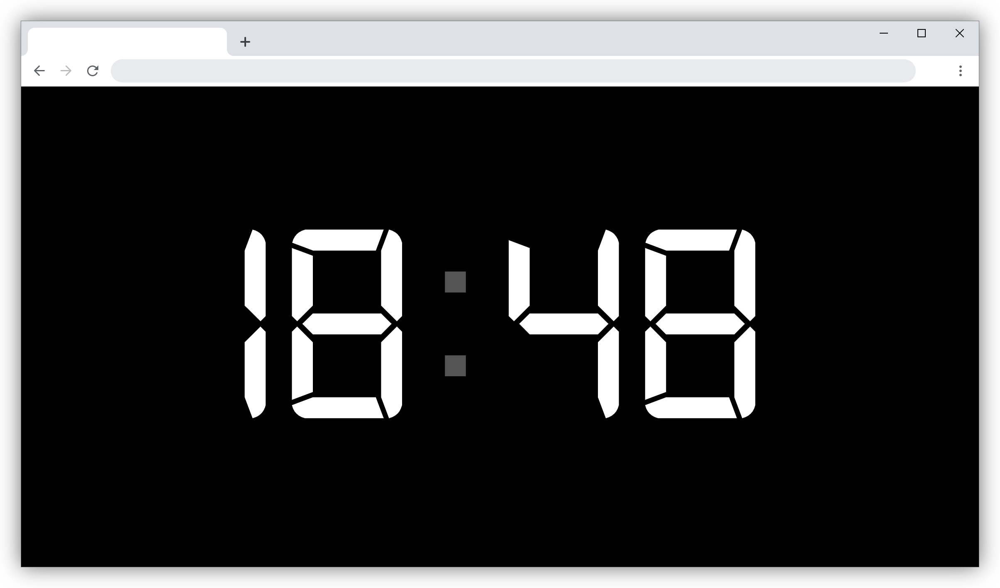

# Fullscreen Timer

A simple fullscreen digital clock display built with HTML, CSS, and JavaScript.

## ⚠️ Important Warning

**This code is from 2016 and may contain outdated dependencies and security vulnerabilities.**

- jQuery 1.12.3 is an older version that may have known security issues
- The code uses ES5 JavaScript and may not be compatible with modern development practices
- Dependencies have not been updated since 2016
- Use at your own risk, especially in production environments

## Screenshot

## Description

This project displays a large, fullscreen digital clock showing hours and minutes. The clock updates every second and features a blinking colon divider. It's designed to be viewed in fullscreen mode for presentations, timers, or as a simple clock display.

## Features

- Fullscreen digital clock display
- Updates in real-time every second
- Blinking colon divider
- Uses a digital font for authentic LED look
- Responsive design that scales with screen size

## Technologies Used

- HTML5
- CSS3
- JavaScript (ES5)
- jQuery 1.12.3
- jQuery UI

## Setup and Usage

1. Clone or download the repository
2. Open `index.html` in a web browser
3. For best experience, view in fullscreen mode (F11 in most browsers)

## License

See LICENSE file for details.
